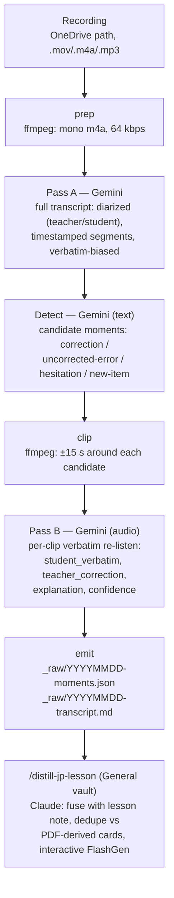

# Architecture — Phase 1 (audio)

## Why moment-centric

STT models are adversarial to this project's goal: their language-model priors auto-correct learner errors (wrong particles become right ones, bad conjugations get fixed) — and those errors *are* the product. Rather than chasing one perfect transcript, the pipeline uses a cheap full-pass to **locate** interesting moments, then a targeted high-fidelity **re-listen** on short clips where an instructable audio model (Gemini) is explicitly told to preserve errors. This is both cheaper and more accurate than a single maximal pass.

## Data flow

## Stages

Every stage writes its output to `work/<date>/` and is skipped on re-run if the output exists (delete a stage file to redo it). This keeps iteration cheap: tuning the detection prompt doesn't re-transcribe the hour.

| Stage | Input | Output (`work/<date>/`) | Model call |
|---|---|---|---|
| prep | recording path | `audio.m4a` | — |
| pass_a | `audio.m4a` | `transcript.json` | Gemini, Files API upload, structured output |
| detect | `transcript.json` | `candidates.json` | Gemini, text-only |
| pass_b | `candidates.json` + clips | `moments.json` | Gemini per clip (clips in `clips/`) |
| emit | transcript + moments | vault `_raw/` files | — |

## Moment taxonomy

- **correction** — teacher recast: Steven says something, Soso先生 echoes it back changed. Detectable from the transcript's adjacency structure even when the transcript is imperfect.
- **uncorrected-error** — Steven's utterance is wrong but the teacher moved on (often deliberately, in favor of bigger fish). Requires the detector to judge grammar itself; these are the highest-value moments since they appear nowhere in the PDF.
- **hesitation** — long pauses, false starts, circumlocution: Steven avoiding a form he doesn't own yet.
- **new-item** — vocab/grammar introduced verbally that may not have reached the whiteboard/PDF.

Garbled or low-confidence transcript regions are treated as candidate moments (likely mistake sites — the garble is signal), routed to Pass B for a verbatim re-listen.

## Prompting notes

- Pass A declares the speakers (teacher: native JA, some EN; student: EN-native learner) and demands verbatim output: keep errors, false starts, fillers; JA in kana/kanji as heard, EN as spoken; per-segment `MM:SS` timestamps and a confidence flag.
- Pass B receives the clip plus the local transcript excerpt and the candidate's rationale, and returns the structured moment record. It must quote the student **exactly**, then separately explain the error and the correction.
- All structured outputs use Gemini's `response_schema` (pydantic models in `models.py`) so parsing is not best-effort.

## Cost envelope

Audio ≈ 32 tokens/s → a 1-hour lesson ≈ 115k input tokens for Pass A (single call, well inside the 1M context). Detect is a text call over the transcript. Pass B is ~20–40 clips × ~30 s ≈ another ~30k audio tokens total. On `gemini-2.5-pro` this is a few dollars per lesson; `--model gemini-2.5-flash` cuts it ~10× if quality holds.

## Phase 2+ (deferred, see ADR-0001/0002)

- **Video/whiteboard fusion**: either Gemini single-pass video, or ffmpeg keyframes (~0.5 fps) + perceptual-hash dedupe (~1 hr of mostly-static screen → 30–100 board states) + VLM reading, joined to the moment timeline by timestamp. Schema extends with a `board_state` field.
- **Dual-engine diff**: a second (local Whisper) transcript; disagreement regions become free mistake-candidate flags.
